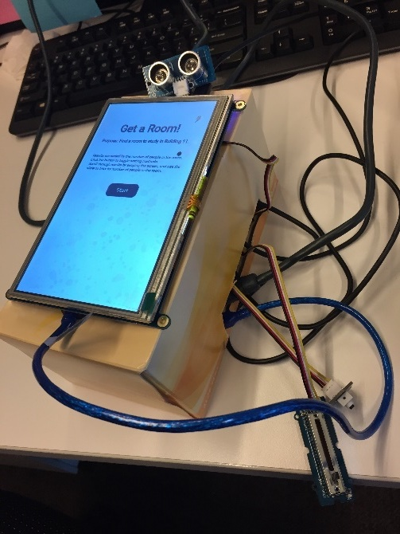

#uts-41019

##Introduction

This is the source code that drove our major project for 41019 (Prototyping Physical Interactions). In this course we designed a prototype kiosk to be placed in UTS Building 11 that allows students to find a room. 

We used an Arduino connected to the Raspberry Pi via a serial port, and a Grove base shield attached to the Arduino, which read from each sensor.

## Quick guide

Example setup of the system:



The device will display a "display is off" message till it detects an object closer than 50cm in front of the ultrasonic ranger sensor. Once you're in range, it'll show a small splashscreen you need to tap "okay" to go through to the main screen.

Currently available rooms will be displayed and you'll be able to change sort mechanisms either using the touchscreen or the button.

Room availability is filtered using the sliding potentiometer; . The people count and temperature data is currently faked since it's not steadily available through the UTS API yet.

##Arduino

### Software

Open in Arduino IDE, and download the following dependencies in the Arduino SDK Manager:

- ArduinoJSON 

You will also need to download the [Ultrasonic Ranger wrapper code](https://github.com/Seeed-Studio/Grove_Ultrasonic_Ranger) and put it in your ~/Documents/Arduino/libraries folder.

### Hardware

We targeted the Genuino 101, but it probably can be ported to most Arduino devices that can connect to Grove hardware.

You will also need the following hardware attached to the Arduino:

- Grove Base Shield
- [Grove Sliding Potentiometer](https://www.seeedstudio.com/Grove-Slide-Potentiometer-p-1196.html)
- [Grove Ultrasonic Ranger](https://www.seeedstudio.com/Grove-Ultrasonic-Ranger-p-960.html)
- [Grove Button](https://www.seeedstudio.com/Grove-Button-p-766.html)

Sensor connections for each sensor to the respective port on the base shield:

D7 - Grove Button
A0 - Ultrasonic Ranger
A1 - Sliding Potentiometer


##Raspberry Pi

## Hardware

- Preferably a Pi 3, otherwise it'll struggle to run.
- A touch-capable screen

## Software

###Requirements

- `nodejs` (6+)
- `npm`

###Install and run

Note: the installation of these libraries can take up to half an hour on a Raspberry Pi since some need to be compiled for ARM processors.

```
$ npm install
$ npm install -g babel-cli
$ npm start
```

Then go to http://localhost:3001

*Note: we assume that the Arduino is connected to a certain serial port on the Raspberry Pi - you'll need to change the value in `index.js` to reflect this.*